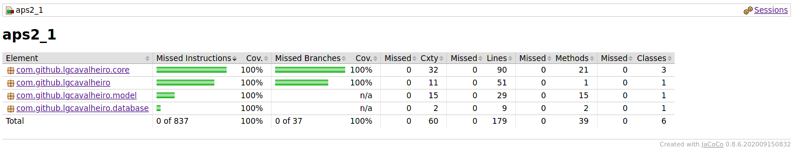
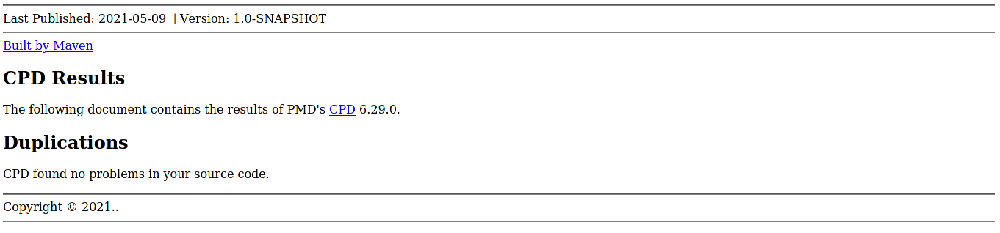
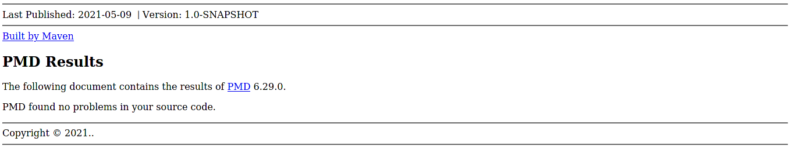

# APS2-1

## Aluno: Lucas Cavalheiro - 2012200347

### Instruções:

Para executar os testes unitários, rodar `mvn clean package`, para executar o programa, rodar `mvn exec:java`.

O programa cria um arquivo para o banco de dados SQLite na raiz do projeto chamado `aps2_1.db` automaticamente durante a sua primeira execução, execuções posteriores mantem a mesma base de dados e seus dados intactos.

Programa feito usando `Apache Maven 3.6.3 (Red Hat 3.6.3-5)`, possíveis problemas de compatibilidade podem ocorrer se utilizada outra versão, estes devem afetar apenas a execução dos testes unitários, a execução do programa em si está (até o momento) estável em outras configurações.

## Coverage

## CPD

## PMD

